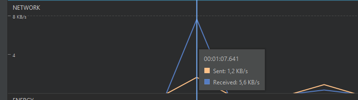

# Consumo de Rede

Dada a natureza de nossa aplicação, naturalmente não ocorre um grande consumo de rede pois nossas chamadas à api contém apenas um pequeno objeto JSON, usualmente de tamanho inexpressivo.

Os valores na imagem são basicamente o máximo de rede usada nas requisições. 

As imagens, quando aparecem nas perguntas, são requisitadas e exibidas utilizando a biblioteca _Picasso_. Elas não vêm diretamente da chamada à nossa API, na verdade esta devolve apenas uma url para a imagem, que será então utilizada pela _Picasso_. Mesmo assim, como as imagens são apenas pixel-arts pequenas, elas pouco influenciam os números de consumo de rede.