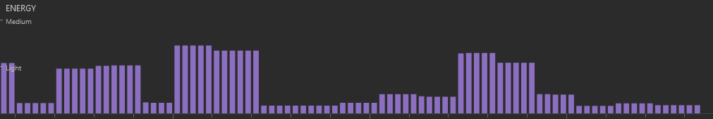
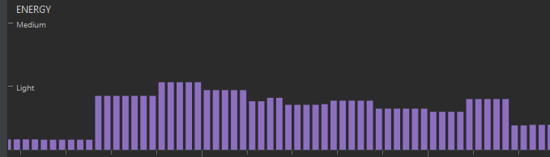

# Bateria

Nosso aplicativo, na maior parte de seu uso, mantém-se no que o Android Profiler considera baixo consumo de energia, poucas vezes beirando o médio. Acreditamos que isso se dê por nossa separação de responsabilidades entre o aplicativo e o servidor, no qual o servidor faz todas as operações pesadas com dados, e a aplicação é responsável basicamente de exibí-los ao usuário e comunicar-se com o servidor.

Consumo de energia ao criar uma sala 

Consumo de energia ao listar as salas disponíveis 
