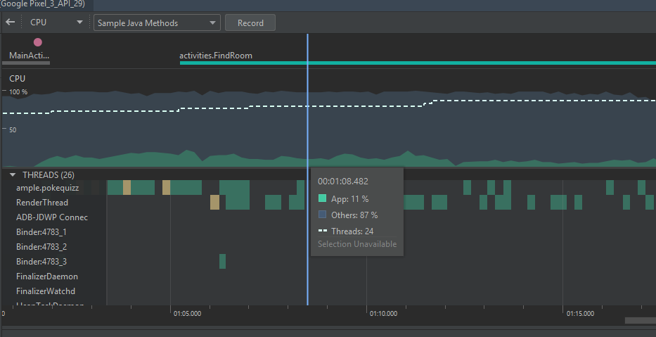

# CPU & Performance

Em geral, não tivemos quaisquer problemas quanto ao desempenho ou uso da CPU. Acreditamos que a separação de componentes, boas práticas adotadas desde o início da etapa de desenvolvimento e uso de bibliotescas externas otimizadas para construir alguns dos componentes mais pesados tenham sido suficientes para tornar nossa aplicação rápida e leve.
Durante o uso, mesmo em modelos de celulares menos avançados, não sentimos a aplicação travar ou perder frames ao realizar as tarefas mais complexas existentes na mesma. A não-perda de frames foi confirmada por nossas análises com o AndroidDevMetrics.

A imagem a seguir é o resultado de uma de nossas análises com o Android Profiler, sendo esta na activity de seleção de salas do app (com vários itens na lista de salas). Pelo que pudemos observar, o uso de CPU não costuma passar muito disso em nenhum momento do uso. 

Um detalhe interessante é que às vezes o uso de CPU disparava do nada enquanto usavamos o emulador no Android Studio, um comportamento que não replicou-se usando um aparelho físico para testar. Dada essa situação, cremos que seja suficientemente seguro afirmar que se trata de alguma peculiaridade do emulador que usamos, e não de nossa aplicação em si.