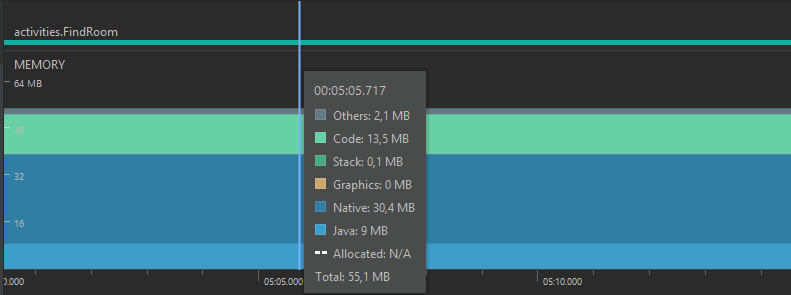

# Memória

O consumo de memória em nosso aplicativo tende a manter-se sempre na faixa dos 55MB, não fugindo muito disso em qualquer momento do uso, com alguns picos rápidos nas telas que contêm as perguntas.
 

// Falar do memory leak e como consertamos